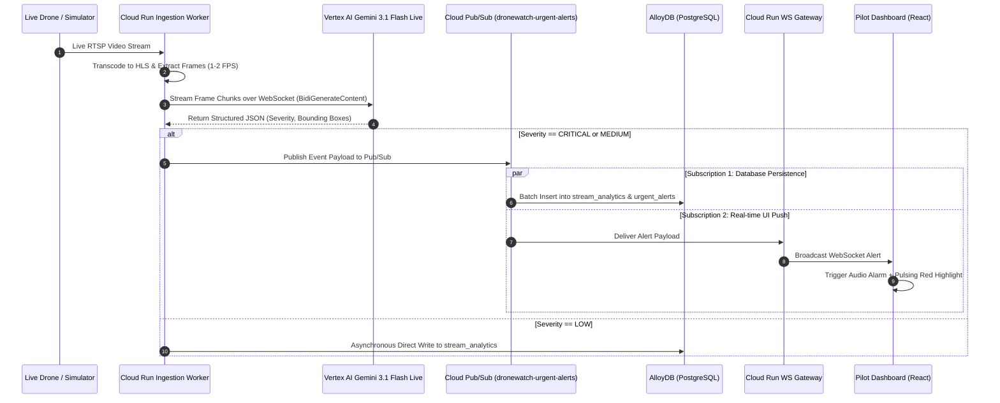
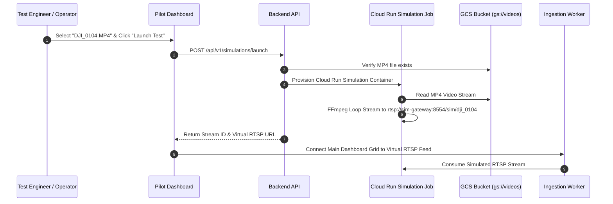

# DroneWatch — Technical Specification (spec.md)

**Document Version:** 1.0.0  
**Target File:** `spec.md`  
**Date:** September 4, 2026  
**Status:** Technical Specification Blueprint  
**Reference Documents:** `dronewatch.md` (PRD), `dronewatch_architecture.md` (ADD)

---

## 1. System Overview & Objectives

**DroneWatch** is an enterprise-grade, cloud-native real-time multi-drone surveillance analytics platform. It ingests live RTSP video feeds from autonomous or human-piloted drone fleets, transcodes video for web playback, runs continuous visual AI understanding using **Vertex AI (Gemini 3.1 Flash Live)**, persists timestamped analytical findings into **Google Cloud AlloyDB for PostgreSQL** (with `pgvector` semantic search), and delivers sub-second visual and auditory threat notifications to security dispatchers and drone pilots.

### 1.1 Core Engineering Goals
1. **Low-Latency Live Video Streaming:** Sub-2-second video playback latency in web browsers across up to 8 simultaneous RTSP drone streams per client.
2. **Dual-Tier Real-Time Gemini AI Pipeline:**
   - **Tier 1 (Multi-Stream Background Ingestion):** 1–2 FPS keyframe decoding sent via persistent WebSocket to Vertex AI for structured event extraction (`LOW`, `MEDIUM`, `CRITICAL` severity).
   - **Tier 2 (Real-Time Gemini Live Focus Session):** Bi-directional, sub-second continuous visual tracking and agentic tool invocation (`BidiGenerateContent` over WebSockets) when a stream is flagged or actively focused by an operator.
3. **Decoupled Architecture:** Asynchronous event broker using **Cloud Pub/Sub** separating AI inference from database persistence and real-time client pushes.
4. **Sub-200ms Alert Propagation:** Instant WebSocket push notifications to pilot dashboards upon detecting `CRITICAL` threats (perimeter breaches, fires, unflagged vehicles, fallen personnel).
5. **Hardware-Independent Simulation:** Built-in test harness converting archived MP4 drone videos into live looping RTSP feeds for offline benchmarking and automated testing.

---

## 2. Technical Stack & Component Decomposition

| Component | Technology / Platform | Purpose & Implementation Details |
| :--- | :--- | :--- |
| **Frontend UI** | React 18, Vite, TypeScript, Tailwind CSS, Lucide Icons, HLS.js / WebRTC Client | Multi-drone grid UI, focused stream view, bounding box overlay canvas, audio alerts, and live activity drawer. |
| **Ingestion Worker** | Node.js (TypeScript) / Go on Cloud Run / GKE Autopilot | FFmpeg / MediaMTX container process handling RTSP stream termination, HLS/WebRTC transcoding, and frame buffer extraction. |
| **AI Processing Engine** | Vertex AI (Gemini 3.1 Flash Live API) | Multimodal Live API over persistent WebSockets using `BidiGenerateContent` for sub-second video reasoning and JSON detection extraction. |
| **Event Bus** | Google Cloud Pub/Sub | Topic `dronewatch-urgent-alerts` decoupling inference workers from downstream writers and push gateways. |
| **Real-Time Push Gateway** | Cloud Run (WebSocket Gateway / Socket.io) | Subscribes to Pub/Sub alerts and broadcasts JSON events over WebSocket connections to connected UI clients. |
| **Primary Database** | Google Cloud AlloyDB for PostgreSQL | High-availability PostgreSQL cluster storing stream metadata, timestamped Gemini analysis logs, bounding box JSON, and 768-dim `pgvector` embeddings. |
| **Media Archive** | Google Cloud Storage (GCS) | Bucket `gs://dronewatch-media-archive` storing snapshot frames for `CRITICAL` alerts and archived video clips. |
| **RTSP Simulator** | Cloud Run Jobs + MediaMTX + GCS | Containerized FFmpeg loop reading MP4s from `gs://dronewatch-simulation-videos/` and publishing looping RTSP feeds. |
| **Edge & Security** | Cloud Armor + External HTTPS/WAF Load Balancer | TLS termination, WAF protection, rate limiting, and Identity-Aware Proxy (IAP) zero-trust access control. |

---

## 3. Data Schemas & Database Specification

### 3.1 Relational Schema DDL (AlloyDB for PostgreSQL)

```sql
-- Enable Extensions
CREATE EXTENSION IF NOT EXISTS "uuid-ossp";
CREATE EXTENSION IF NOT EXISTS vector;

-- Table 1: Drone Streams Registry
CREATE TABLE drone_streams (
    stream_id UUID PRIMARY KEY DEFAULT uuid_generate_v4(),
    drone_name VARCHAR(100) NOT NULL,
    rtsp_url VARCHAR(500) NOT NULL UNIQUE,
    status VARCHAR(20) NOT NULL DEFAULT 'INACTIVE' 
        CHECK (status IN ('ACTIVE', 'INACTIVE', 'RECONNECTING', 'ERROR')),
    is_simulation BOOLEAN NOT NULL DEFAULT FALSE,
    source_file VARCHAR(255),
    created_at TIMESTAMP WITH TIME ZONE NOT NULL DEFAULT CURRENT_TIMESTAMP,
    updated_at TIMESTAMP WITH TIME ZONE NOT NULL DEFAULT CURRENT_TIMESTAMP
);

-- Table 2: Timestamped Gemini Analysis Findings
CREATE TABLE stream_analytics (
    event_id UUID PRIMARY KEY DEFAULT uuid_generate_v4(),
    stream_id UUID NOT NULL REFERENCES drone_streams(stream_id) ON DELETE CASCADE,
    timestamp TIMESTAMP WITH TIME ZONE NOT NULL,
    severity VARCHAR(20) NOT NULL CHECK (severity IN ('LOW', 'MEDIUM', 'CRITICAL')),
    category VARCHAR(50) NOT NULL,
    summary TEXT NOT NULL,
    detailed_analysis TEXT,
    bounding_boxes JSONB DEFAULT '[]'::jsonb,
    raw_response JSONB NOT NULL,
    embedding vector(768),
    created_at TIMESTAMP WITH TIME ZONE NOT NULL DEFAULT CURRENT_TIMESTAMP
);

-- Table 3: Urgent Notifications & Acknowledgments
CREATE TABLE urgent_alerts (
    alert_id UUID PRIMARY KEY DEFAULT uuid_generate_v4(),
    event_id UUID NOT NULL REFERENCES stream_analytics(event_id) ON DELETE CASCADE,
    stream_id UUID NOT NULL REFERENCES drone_streams(stream_id) ON DELETE CASCADE,
    timestamp TIMESTAMP WITH TIME ZONE NOT NULL,
    severity VARCHAR(20) NOT NULL DEFAULT 'CRITICAL',
    is_acknowledged BOOLEAN NOT NULL DEFAULT FALSE,
    acknowledged_by VARCHAR(100),
    acknowledged_at TIMESTAMP WITH TIME ZONE,
    notes TEXT,
    created_at TIMESTAMP WITH TIME ZONE NOT NULL DEFAULT CURRENT_TIMESTAMP
);

-- Indexes for High-Throughput Analytics & Real-Time Dashboard Queries
CREATE INDEX idx_drone_streams_status ON drone_streams(status);
CREATE INDEX idx_analytics_stream_time ON stream_analytics(stream_id, timestamp DESC);
CREATE INDEX idx_analytics_severity ON stream_analytics(severity) WHERE severity = 'CRITICAL';
CREATE INDEX idx_alerts_unack ON urgent_alerts(is_acknowledged) WHERE is_acknowledged = FALSE;

-- HNSW Vector Index for Semantic Natural Language Search
CREATE INDEX idx_analytics_embedding ON stream_analytics 
USING hnsw (embedding vector_cosine_ops);
```

### 3.2 Bounding Box & Gemini Output JSON Schema

Gemini outputs structured JSON matching the following contract:

```json
{
  "$schema": "http://json-schema.org/draft-07/schema#",
  "type": "object",
  "required": ["stream_id", "timestamp", "severity", "category", "summary", "bounding_boxes"],
  "properties": {
    "stream_id": { "type": "string", "format": "uuid" },
    "timestamp": { "type": "string", "format": "date-time" },
    "severity": { "type": "string", "enum": ["LOW", "MEDIUM", "CRITICAL"] },
    "category": { 
      "type": "string", 
      "enum": ["Intrusion", "Fire_Safety", "Vehicle_Anomaly", "Personnel_Safety", "Equipment", "General"] 
    },
    "summary": { "type": "string", "maxLength": 255 },
    "detailed_analysis": { "type": "string" },
    "bounding_boxes": {
      "type": "array",
      "items": {
        "type": "object",
        "required": ["label", "box"],
        "properties": {
          "label": { "type": "string" },
          "confidence": { "type": "number", "minimum": 0, "maximum": 1 },
          "box": {
            "type": "array",
            "description": "Normalized coordinates [ymin, xmin, ymax, xmax] scaled 0 to 1000",
            "minItems": 4,
            "maxItems": 4,
            "items": { "type": "integer", "minimum": 0, "maximum": 1000 }
          }
        }
      }
    }
  }
}
```

---

## 4. API Contracts & Interface Specifications

### 4.1 REST API Endpoints (Backend API Gateway)

#### `GET /api/v1/streams`
Lists all configured drone streams and their current health status.
- **Response `200 OK`**:
```json
[
  {
    "stream_id": "9b1deb4d-3b7d-4bad-9bdd-2b0d7b3dcb6d",
    "drone_name": "Perimeter Drone Alpha",
    "rtsp_url": "rtsp://10.0.1.50:554/live/stream1",
    "status": "ACTIVE",
    "is_simulation": false,
    "created_at": "2026-09-04T12:00:00Z"
  }
]
```

#### `POST /api/v1/streams`
Registers a new RTSP drone stream.
- **Request Payload**:
```json
{
  "drone_name": "North Gate Drone",
  "rtsp_url": "rtsp://10.0.1.51:554/live/stream2"
}
```

#### `POST /api/v1/simulations/launch`
Triggers an RTSP simulation job for a stored MP4 file.
- **Request Payload**:
```json
{
  "drone_name": "Simulated Patrol 01",
  "source_file": "DJI_0104.MP4"
}
```
- **Response `201 Created`**:
```json
{
  "stream_id": "c3a1f9e2-8b4a-4f11-9a7c-123456789abc",
  "rtsp_url": "rtsp://sim-gateway.dronewatch.internal:8554/sim/dji_0104",
  "status": "ACTIVE",
  "is_simulation": true
}
```

#### `GET /api/v1/analytics`
Fetches historical Gemini analysis events with optional filtering.
- **Query Parameters**:
  - `stream_id` (UUID, optional)
  - `severity` (`LOW` | `MEDIUM` | `CRITICAL`, optional)
  - `search_query` (string, triggers `pgvector` semantic search if provided)
  - `limit` (default: 50)
  - `offset` (default: 0)

#### `POST /api/v1/alerts/{alert_id}/acknowledge`
Acknowledges an urgent critical notification.
- **Request Payload**:
```json
{
  "acknowledged_by": "Pilot_John_Doe",
  "notes": "Verified intrusion; security guard dispatched."
}
```

---

### 4.2 WebSocket Communication Contracts

#### Pilot UI Push Gateway WebSocket (`ws://host/ws/pilot`)
Client connects to receive real-time detection events and alerts across all active streams.

* **Server-to-Client Event: `CRITICAL_ALERT`**
```json
{
  "event_type": "CRITICAL_ALERT",
  "alert_id": "e4f3a2b1-1234-4567-89ab-cdef01234567",
  "stream_id": "9b1deb4d-3b7d-4bad-9bdd-2b0d7b3dcb6d",
  "drone_name": "Perimeter Drone Alpha",
  "timestamp": "2026-09-04T20:14:00.123456Z",
  "severity": "CRITICAL",
  "category": "Intrusion",
  "summary": "Unauthorized person climbing North Perimeter Fence",
  "bounding_boxes": [
    {
      "label": "Person",
      "confidence": 0.94,
      "box": [120, 450, 380, 610]
    }
  ]
}
```

* **Server-to-Client Event: `STREAM_STATUS_CHANGE`**
```json
{
  "event_type": "STREAM_STATUS_CHANGE",
  "stream_id": "9b1deb4d-3b7d-4bad-9bdd-2b0d7b3dcb6d",
  "status": "RECONNECTING",
  "message": "RTSP packet loss detected. Retrying connection..."
}
```

---

## 5. System Data Flows & Process Sequences

### 5.1 Ingestion, AI Inference & Alert Propagation Flow



### 5.2 RTSP Simulation Test Execution Flow



---

## 6. Security, Networking & Infrastructure

### 6.1 VPC & Perimeter Security
- **Network Boundaries:** All database instances (AlloyDB), Pub/Sub brokers, and processing workers reside within a private Google Cloud VPC (`dronewatch-vpc`).
- **Private Access:** Cloud Run communicates with AlloyDB and Vertex AI using a **Serverless VPC Access Connector** and **Private Service Connect (PSC)**. Zero public IP exposure for the database tier.
- **Edge Protection:** **Cloud Armor** enforces Web Application Firewall (WAF) filtering against OWASP Top 10 vulnerabilities, IP rate-limiting, and DDoS mitigation at the external Load Balancer.

### 6.2 Zero-Trust Identity & Secrets Management
- **User Authentication:** **Identity-Aware Proxy (IAP)** controls access to the web UI, enforcing Google SSO and Multi-Factor Authentication (MFA).
- **Service Identity:** Microservices use GCP **Workload Identity** and IAM Service Accounts with least-privilege roles (e.g., `roles/alloydb.client`, `roles/aiplatform.user`, `roles/pubsub.publisher`).
- **Secrets:** Database passwords and external integration tokens stored in **Google Cloud Secret Manager** and mounted as environment secrets.

---

## 7. Performance Targets, Fallbacks & Error Handling

### 7.1 Key Latency Budgets (SLAs)

| Operational Metric | Target Threshold | Maximum Acceptable |
| :--- | :--- | :--- |
| **RTSP Stream Playback Latency** | $< 1.5$ seconds | $< 2.0$ seconds |
| **Gemini Video Analysis Latency** | $< 2.0$ seconds | $< 3.0$ seconds |
| **Pub/Sub to WebSocket Push Latency** | $< 100$ ms | $< 200$ ms |
| **End-to-End Threat Detection to UI Alert** | $< 2.5$ seconds | $< 4.0$ seconds |
| **AlloyDB Write Transaction Latency** | $< 15$ ms | $< 50$ ms |

### 7.2 Fault Tolerance & Fallback Strategies

1. **Gemini API Rate-Limiting / Quota Throttling (`429 Too Many Requests`):**
   - Automatically fall back from 2 FPS frame sampling to 0.5 FPS (1 frame every 2 seconds).
   - Maintain uninterrupted video streaming to the UI.
   - Implement exponential backoff with jitter on Gemini WebSocket reconnects.
2. **RTSP Stream Interruption:**
   - Detect packet loss or socket drops within 3 seconds.
   - UI status indicator transitions to `RECONNECTING` with an amber badge.
   - Ingestion worker executes an exponential backoff retry loop (1s, 2s, 4s, 8s, up to max 30s).
3. **Database Write Failure / Network Partition:**
   - Ingestion worker buffers non-critical analytics in an in-memory queue (up to 1,000 items).
   - Urgent alerts published to Pub/Sub persist in Pub/Sub topics until AlloyDB recovery.

---

## 8. Verification & Test Plan

### 8.1 Automated Unit & Integration Tests
- **API Test Suite:** Test CRUD operations on `/api/v1/streams` and `/api/v1/analytics`.
- **Database Integration Tests:** Verify schema constraints, index performance, and `pgvector` similarity queries against an AlloyDB emulator / test instance.
- **WebSocket Gateway Tests:** Mock Pub/Sub messages and verify correct JSON payload delivery over WebSockets to client subscribers.

### 8.2 End-to-End Simulation Testing
- **Local Test Clips:** Use `./videos/DJI_0104.MP4` and `./videos/S1001976.MP4` via the RTSP Simulation Engine.
- **Verification Criteria:**
  1. Launch simulation feed via REST API.
  2. Verify RTSP stream renders cleanly in the UI grid with $<2.0$s latency.
  3. Confirm Gemini extracts bounding boxes and detects simulated threats.
  4. Validate that `CRITICAL` alerts trigger visual red borders, audible alarms, and correct writes in AlloyDB `stream_analytics` and `urgent_alerts` tables.

---

## 9. Deliverables Summary

1. `spec.md` — Technical Specification Blueprint (This document).
2. `dronewatch.md` — Product Requirement Document (PRD).
3. `dronewatch_architecture.md` — Architecture Design Document (ADD).
